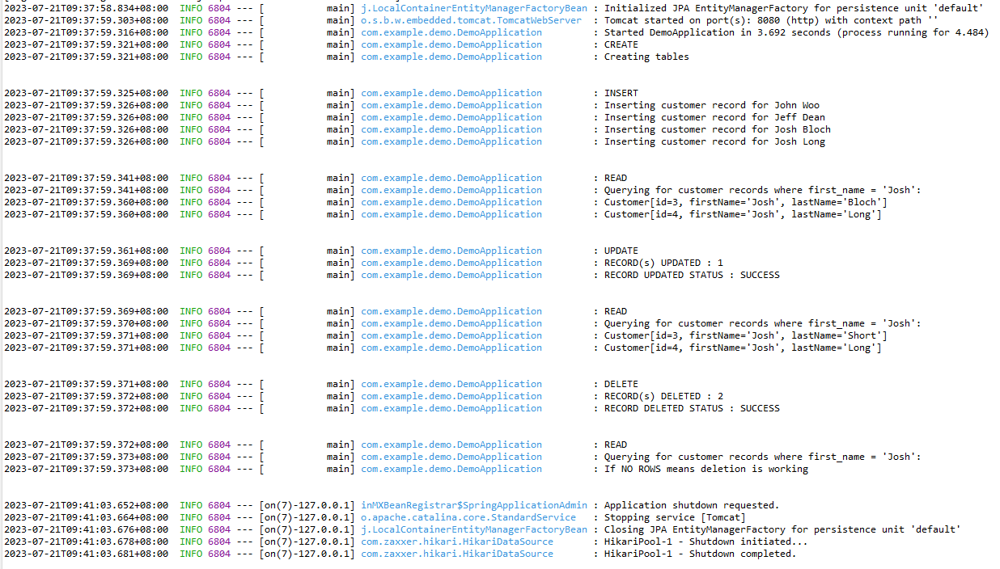

### Spring Boot Demo 6 Database Example (H2 Database - Access_Data_using_JdbcTemplate)

**Steps:**
<ol>
<li>To setup IDE for Spring project, follow steps in https://github.com/worldpeacez0991/SpringBoot_demo1</li>

<li>Add External Jar to Classpath for H2 driver 
You may refer to Step 2 of https://github.com/worldpeacez0991/SpringBoot_demo5_Database.
</li>
 

<li>If you are using existing project from SpringBoot_demo5_Database, remember to replace these files 
Replace these files: 
<ul>
<li>build.gradle</li>
<li>src\main\java\com\example\demo\DemoApplication.java</li>
<li>src\main\java\com\example\demo\CustomerRowMapper.java</li>
<li>src\main\java\com\example\demo\Customer.java</li>
</ul>
</li>
 

<li>When Spring Boot Application starts, SQL Data is loaded in 2 ways:
<ul>
<li>Via SQL file preload, with this file 'src\main\resources\data.sql'</li>
<li>Via JdbcTemplate in code, with this file 'src\main\java\com\example\demo\DemoApplication.java' - CRUD Example</li>
</ul>
</li>
 

<li>Start Spring Boot App
<ul>
<li>Via Spring IDE, open 'DemoApplication.java', press 'Alt+Shift+X, B', to start 'Spring Boot App' 
This shows how to use Spring Boot JdbcTemplate to access H2 Database with CRUD (CREATE, READ, UPDATE, DELETE)</li> 
<kbd></kbd>
</ul>
</li>

 
<li>Via browser, type 'http://localhost:8080/h2-console', to test
 
You may refer to Step 4 of https://github.com/worldpeacez0991/SpringBoot_demo5_Database.</li>
</li>

Credits: https://spring.io/team 
Source: https://www.baeldung.com/spring-boot-h2-database 
Discussion: https://stackoverflow.com/questions/4573975/jpa-vs-spring-jdbctemplate 

